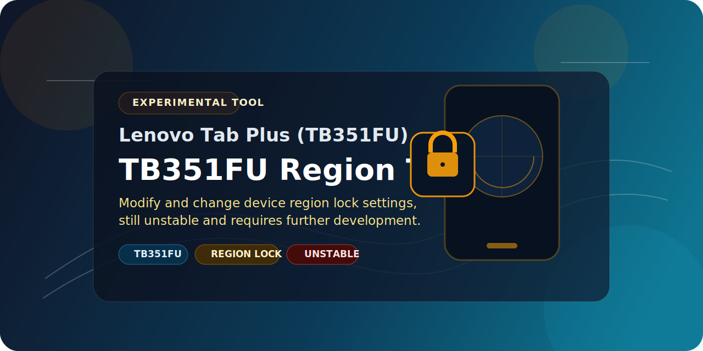

# TB351FU (Lenovo Tab Plus) Region Conversion Toolkit



This repository contains tools to convert the **Lenovo Tab Plus (TB351FU)** from Global (ROW) hardware to the Chinese (PRC/ZUI) ROM.

## 🚀 NO PROINFO FLASHING REQUIRED
> [!IMPORTANT]
> **DO NOT flash `proinfo.bin`.** Our research has confirmed that modifying the `proinfo` partition is **NOT** necessary to boot the CN ROM and carries high risk (losing Serial Number and Widevine L1). 
> 
> The region lock is bypassed by patching the **Bootloader (LK)** and **Device Tree (DTBO)** instead.

---

## 🧪 How it Works
The TB351FU bootloader checks if the hardware region (from RPMB) matches the software region (from DTBO). If you flash a stock CN ROM on ROW hardware, the bootloader sees `ROW vs PRC` and powers off.

**Our Bypass:**
1.  **DTBO Patch:** Changes the "Expected" region in the CN firmware from `PRC` to `ROW`. This makes the bootloader check **PASS**.
2.  **LK Patch:** Spoofs the system property `androidboot.countrycode=CN`. This tricks the Android OS (ZUI) into thinking it is running on a Chinese device, enabling all ZUI features and bypassing system-level region checks.

---

## 🛠 Usage Instructions

### 1. Prerequisites
-   **Bootloader Unlocked** (Orange State must be visible).
-   CN ROM Firmware files.
-   Linux environment (or WSL) to run the patch script.

### 2. Patching the Firmware
1.  Copy **`lk.img`** and **`dtbo.img`** from your CN ROM folder into the **`assets/`** directory of this tool.
2.  Run the conversion script:
    ```bash
    chmod +x convert_cn_to_row.sh
    ./convert_cn_to_row.sh
    ```
3.  The patched images will be created in the **`modified/`** folder.

### 3. Flashing
1.  Open **SP Flash Tool v6**.
2.  Load the **CN ROM Scatter file**.
3.  In the partition list, replace the following files with our patched versions:
    -   `dtbo` -> **`modified/dtbo_patched.img`**
    -   `lk` -> **`modified/lk_patched.img`**
4.  **Keep original CN files** for `preloader`, `boot`, `vendor_boot`, `vbmeta`, and `super`.
5.  Flash using **"Download Only"** mode.
6.  **Wipe Data:** After flashing, you **must** enter recovery and perform a **Factory Reset** (Format Userdata/Metadata) to boot successfully.

---

## 📂 File Structure
-   `convert_cn_to_row.sh`: Automates the hex patching process.
-   `magiskboot`: The core utility used for hex patching.
-   `assets/`: Place your stock CN images here.
-   `modified/`: The output folder for compatible images.
-   `2_patch_region.py`: (Legacy) Previous method for proinfo patching (Not recommended).

---

> [!NOTE]
> For more development links, custom recoveries, and ROMs, visit the [TB351FU DevHub](https://helllopratik.github.io/tb351fu/).
